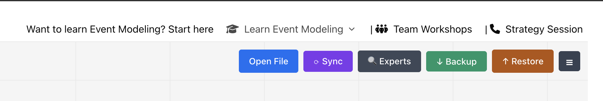
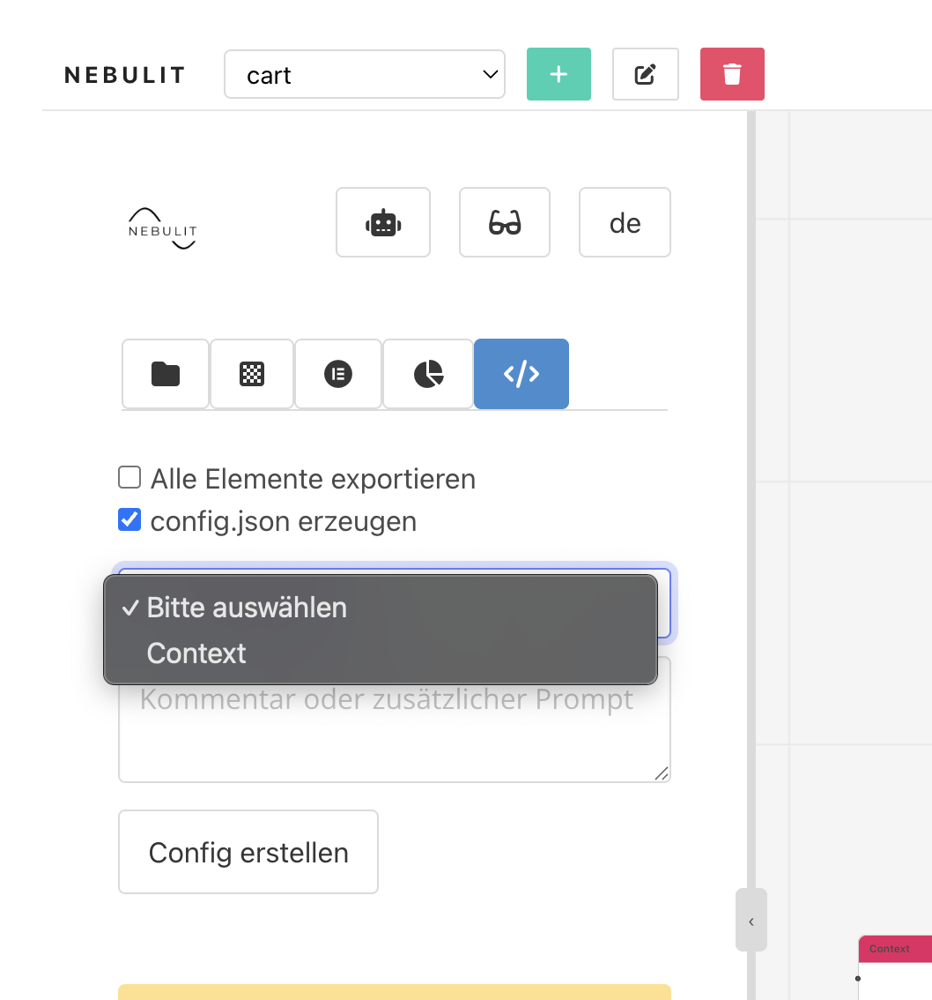
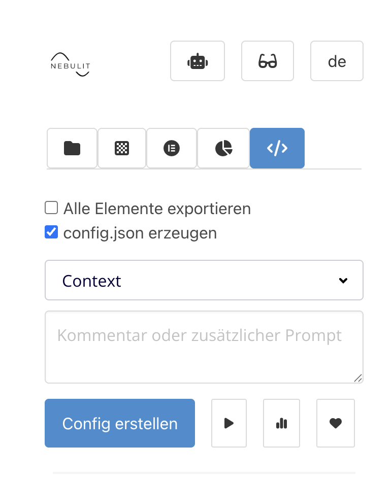

# Shopping Cart — Event Modeling Sample

A 10-minute event modeling session showcasing how to use the new Event Modeling Toolkit.

## Video

[Watch on YouTube](https://youtu.be/S9O05PcsBsY)

## About

This sample demonstrates a live event modeling session for a shopping cart domain. In under 10 minutes, the session walks through the core workflow of the Event Modeling Toolkit — capturing events, commands, read models, and their relationships on a single timeline.

## Try It Yourself

### Step 1 — Open the Canvas

Go to [eventmodelers.de/canvas](https://www.eventmodelers.de/canvas) and click **Restore** in the toolbar.

Select the file `eventmodel-backup-2026-03-27.json` from this repository to load the model.

### Step 2 — Select the Context

Select all elements on the canvas (Ctrl+A / Cmd+A), then use the **Export Selection** option in the toolbar to prepare the model for export.

### Step 3 — Export to Lovable

Use the **Export to Lovable** action to send the model directly to [Lovable](https://lovable.dev), where it can be used to scaffold a working application from the event model.

## Contents

- `eventmodel-backup-2026-03-27.json` — exported event model from the session
- `eventmodeling_restore_menu.png` — screenshot of the Restore toolbar